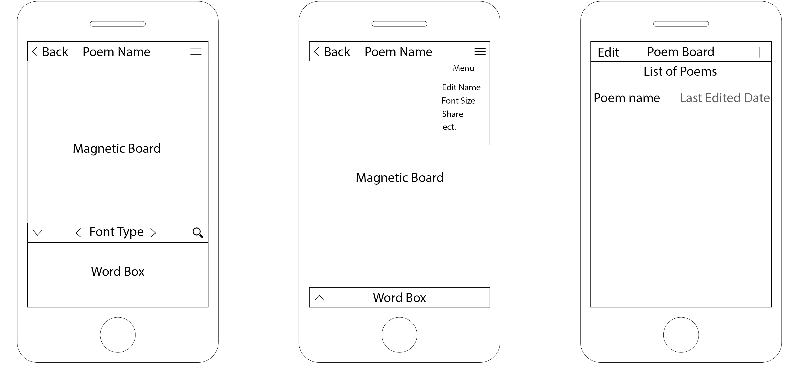
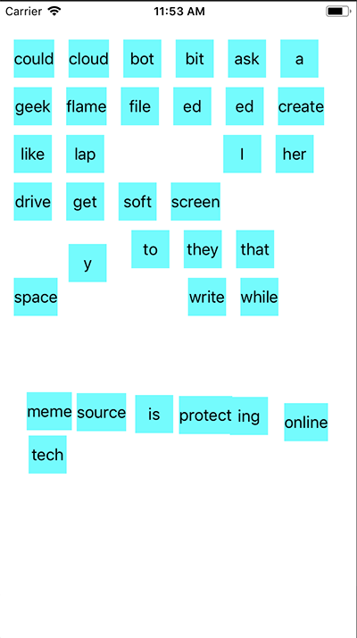
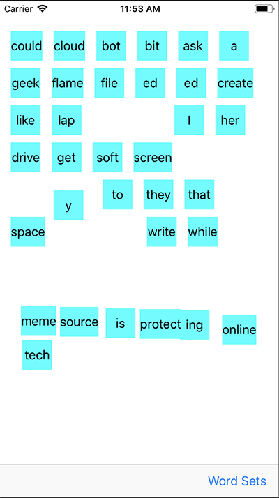
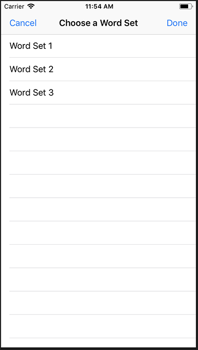
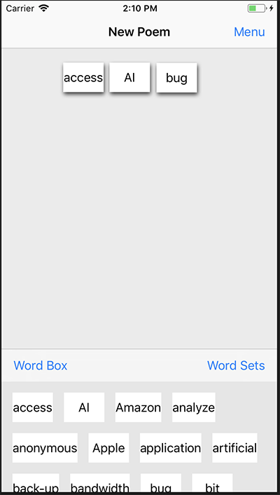
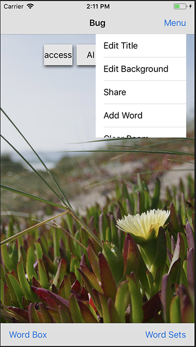

# Magnetic Poetry
Sungmin Park and Ian Oliver

A interactive word based app. 

<a href="#Checkpoint-1">Checkpoint 1</a>  
<a href="#Checkpoint-2">Checkpoint 2</a>  
<a href="#Final-Checkpoint">Final Checkpoint</a>  

## Proposed Features  
* Edit poem name
* Change font size
* Word Box containing all words  
* Different fonts  
* Ability to share poem to social media   

## Checkpoint 1  

### Initial Design
The goal is to create a word magnet app that will be easy to understand and use for any user.  

  

### App State  
User are able to drag words using the pan gesture. Words are neatly positioned at the top of the app. It works as a universal app on iPhone/iPad.  

### New Features  
* Basic app icon image
* Basic app launch screen image
* Draggable Words
* Min word size is 40x40px
* Words are neatly placed at the top of the screen

### Upcoming
* Basic toolbar
* Basic word set select screen

<a href="#Magnetic-Poetry">To Top</a>  

## Checkpoint 2  

### App State  
Added in a toolbar with a button that will open up the word set table menu.  

From this screen users will be able to select different word sets. Currently just labeled as Word Set 1, Word Set 2... until we come up with a overall theme and distinct word sets.  

### New Features  
* Create Tabel View (Word Set)
* Word Set is replaced when different set is selected

### Upcoming  
* Word Box
* Basic Menu
* Share Features
* Backgrounds

<a href="#Magnetic-Poetry">To Top</a>  

## Final Checkpoint  

### App State  
User is able to select words from a collapsible word box and change between various word sets.  

User is able to use the menu to edit the poem title, background image, share to social media, add new words, or clear their poem.  

### New Features  
* Collapsible Word Box
* Able to Edit Poem Title
* Able to Edit Background
* Share Feature
* Able to Add Custom Words
* Able to Clear Poem
* New Word Sets
* Poem Title and Poem Saves
* Current Selected Word Set Saves on exit

### Updated Features  
* Smoother label drag
* App Icon Updated
* Launch Screen Updated

<a href="#Magnetic-Poetry">To Top</a>  
