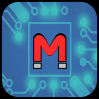
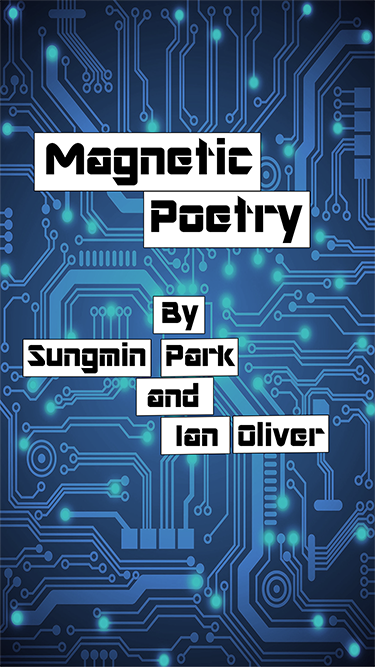

# Word-Magnets

<a href="#Current-App-Icon">Current App Icon</a>  
<a href="#Current-App-Launch-Screen">Current App Launch Screen</a>  
<a href="#Current-App-Startup-Look">Current App Startup Look</a>  
<a href="#Milestone-1-Work">Milestone 1 Work</a>  

## Current App Icon
</img>  

This is a basic design of what the app icon will look like. In future updates the icon will likely be changed.

## Current App Launch Screen
</img>  

This is a basic design of what the launch screen will look like. In the futre will will be updated to better
fit the theme of our words. Will also look into finding a better solution for the difference in iphone and
ipad launch screen size.

## Current App Startup Look
</img>  

This is what the app looks like once it has finished loading in. At the moment the cyan rectangles around the
word is the touch event size (min size is 40x40px). On both iPhone and iPad the app will load the words in a
row until it gets to close to the edge of the screen. It will start a new row and continue until all words are
placed on screen.

## Milestone 1 Work
* Clone Magneto Code
* Update placeWords func to neatly place words in rows
* Words have min size of 40x40px (currently showing size with cyan background)
* Basic app icon image
* Basic app launch screen image